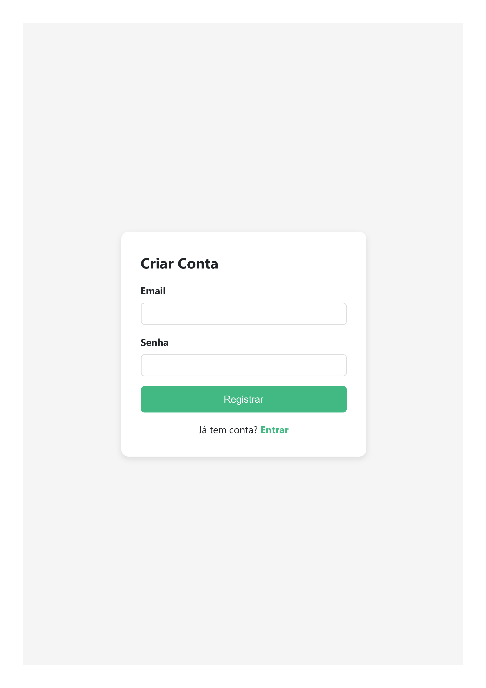
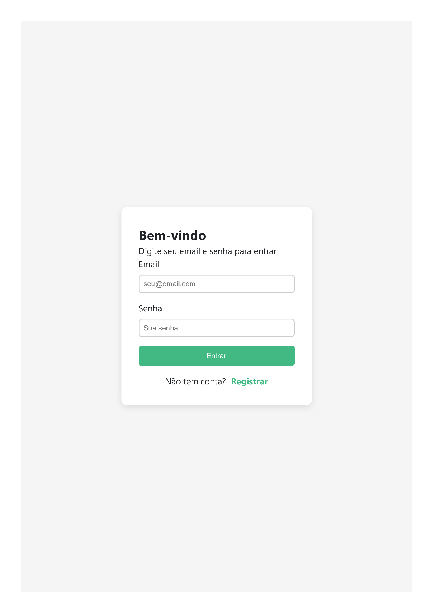
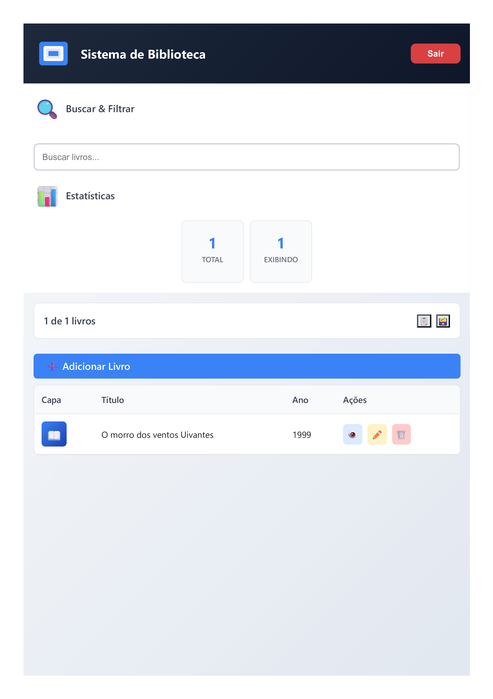
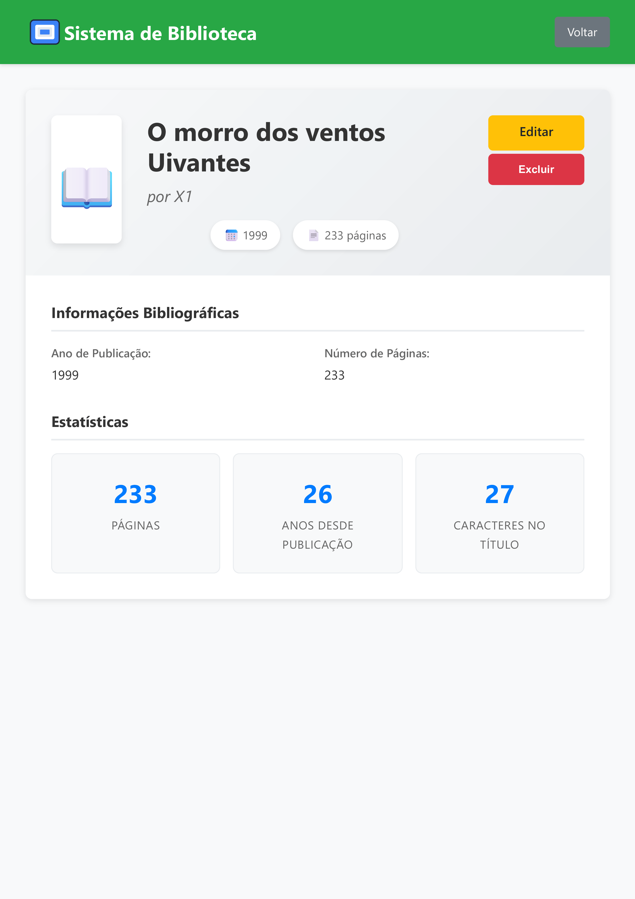
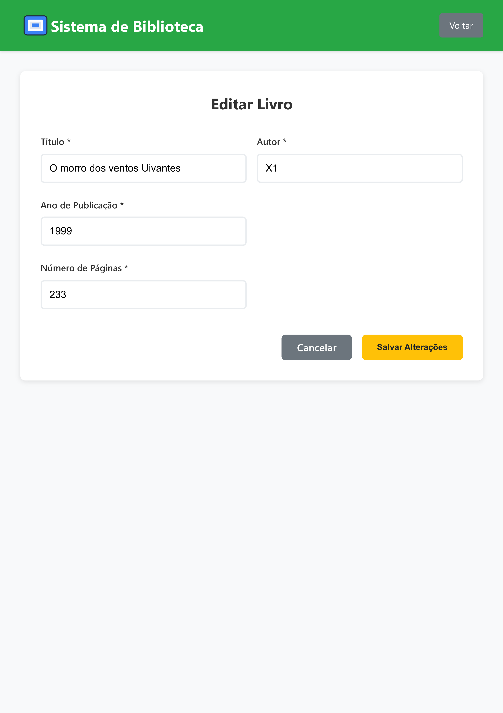

# Sistema de Biblioteca

Um sistema completo de gerenciamento de biblioteca desenvolvido com Vue.js no frontend e Node.js no backend, utilizando Supabase como banco de dados.

# Link do video do youtube

[](https://youtu.be/13fXHcK1Zwg)

## 📋 Índice

- [Características](#características)
- [Tecnologias Utilizadas](#tecnologias-utilizadas)
- [Estrutura do Projeto](#estrutura-do-projeto)
- [Instalação e Execução](#instalação-e-execução)
- [Interface do Sistema](#interface-do-sistema)
- [Estrutura do Código](#estrutura-do-código)
- [Funcionalidades](#funcionalidades)
- [Docker](#docker)
- [Scripts Disponíveis](#scripts-disponíveis)

## Características

- **Gerenciamento de Livros**: Adicionar, editar, visualizar e excluir livros
- **Sistema de Autenticação**: Login e cadastro de usuários
- **Interface Responsiva**: Design moderno e adaptável a diferentes dispositivos
- **Permissões de Usuário**: Controle de acesso baseado em autenticação
- **Busca e Filtros**: Sistema de busca por título e autor
- **Visualização Múltipla**: Visualização em tabela e cards

## Tecnologias Utilizadas

### Frontend
- **Vue.js 3** - Framework JavaScript progressivo
- **TypeScript** - Superset tipado do JavaScript
- **Vue Router** - Roteamento para aplicações Vue.js
- **Vite** - Build tool moderna e rápida

### Backend
- **Node.js** - Runtime JavaScript no servidor
- **Express.js** - Framework web para Node.js
- **Supabase** - Backend-as-a-Service com PostgreSQL

### DevOps
- **Docker** - Containerização da aplicação
- **Docker Compose** - Orquestração de containers

## Estrutura do Projeto

```
boticario_me_contrata/
├── client/                     # Frontend Vue.js
│   ├── src/
│   │   ├── components/         # Componentes reutilizáveis
│   │   │   └── UserHeader.vue
│   │   ├── pages/              # Páginas da aplicação
│   │   │   ├── BookList.vue    # Lista de livros
│   │   │   ├── BookCreate.vue  # Criação de livros
│   │   │   ├── BookEdit.vue    # Edição de livros
│   │   │   ├── BookDetail.vue  # Detalhes do livro
│   │   │   ├── login.vue       # Página de login
│   │   │   └── cadastro.vue    # Página de cadastro
│   │   ├── services/           # Serviços de API
│   │   ├── router/             # Configuração de rotas
│   │   └── composables/        # Composables Vue
│   ├── public/                 # Arquivos estáticos
│   ├── Dockerfile              # Container de produção
│   ├── Dockerfile.dev          # Container de desenvolvimento
│   └── package.json
├── server/                     # Backend Node.js
│   ├── src/
│   │   ├── routes/             # Rotas da API
│   │   └── server.js           # Servidor principal
│   ├── Dockerfile              # Container de produção
│   ├── Dockerfile.dev          # Container de desenvolvimento
│   └── package.json
├── docker-compose.yml          # Configuração para produção
├── docker-compose.dev.yml      # Configuração para desenvolvimento
├── .env.example                # Exemplo de variáveis de ambiente
└── makefile                    # Comandos de build automatizados
```

## Instalação e Execução

### Pré-requisitos

- Docker e Docker Compose instalados
- Node.js 18+ (para desenvolvimento local)
- Conta no Supabase (para configuração do banco de dados)

### 1. Clonando o Repositório

```bash
git clone <url-do-repositorio>
cd <nome-do-repositorio>
```

### 2. Configuração das Variáveis de Ambiente

Copie o arquivo de exemplo e configure suas variáveis:

```bash
cp .env.example .env
```

Edite o arquivo `.env` com suas configurações do Supabase:

```env
# Backend runtime
PORT_FRONTEND=9000
PORT_BACKEND=9001
VITE_API_URL=http://localhost:9001
SUPABASE_AUTO_CONFIRM=true

# Supabase
SUPABASE_URL=sua_url_do_supabase
SUPABASE_SERVICE_ROLE_KEY=sua_service_role_key
SUPABASE_ANON_KEY=sua_anon_key
```

### 3. Executando com Docker (Recomendado)

#### Desenvolvimento
```bash
# Usando makefile
make dev

# Ou diretamente com docker-compose
docker-compose -f docker-compose.dev.yml up --build
```

#### Produção
```bash
# Usando makefile
make production

# Ou diretamente com docker-compose
docker-compose up --build
```

### 4. Executando Localmente (Opcional)

#### Frontend
```bash
cd client
npm install
npm run dev
```

#### Backend
```bash
cd server
npm install
npm run dev
```

### 5. Acessando a Aplicação

- **Frontend**: http://localhost:9000
- **Backend API**: http://localhost:9001

## Interface do Sistema

### Tela de Cadastro

A interface de cadastro permite que novos usuários se registrem no sistema.



### Tela de Login
A interface de autenticação permite que usuários façam login ou se cadastrem no sistema.



### Lista de Livros
Dashboard principal mostrando a lista de livros com opções de visualização em tabela e cards



### Detalhes do Livro
Página de detalhes exibindo informações completas de um livro específico.



### Formulário de Edição
Página para adicionar ou editar informações de livros.



## Estrutura do Código

### Frontend (Vue.js + TypeScript)

#### Componentes Principais

- **[`BookList.vue`](client/src/pages/BookList.vue)**: Página principal com lista de livros, busca e filtros
- **[`BookEdit.vue`](client/src/pages/BookEdit.vue)**: Formulário de edição de livros com validação

#### Serviços

- **API Service**: Abstração para comunicação com o backend
- **Auth Service**: Gerenciamento de autenticação e tokens
- **Book Service**: Operações específicas de livros

#### Roteamento

O [`router/index.ts`](client/src/router/index.ts) configura:
- Rotas públicas (lista de livros, detalhes)
- Rotas protegidas (criação, edição)
- Guards de autenticação
- Redirecionamentos

### Backend (Node.js + Express)

#### Servidor Principal
O [`server.js`](server/src/server.js) configura:
- Middleware CORS
- Parsing de JSON
- Rotas da API
- Health check endpoint

#### Configuração Docker

##### Desenvolvimento
- Hot reload ativado
- Volumes para desenvolvimento
- Debugging habilitado

##### Produção
- Build otimizado
- Imagem Alpine Linux
- Configurações de segurança

## Funcionalidades

### Gerenciamento de Livros
- ✅ Listar todos os livros
- ✅ Visualizar detalhes de um livro
- ✅ Adicionar novo livro (autenticado)
- ✅ Editar livro existente (autenticado)
- ✅ Excluir livro (autenticado)

### Sistema de Busca
- ✅ Busca por título
- ✅ Busca por autor
- ✅ Filtros em tempo real
- ✅ Contadores de resultados

### Autenticação
- ✅ Login de usuários
- ✅ Cadastro de novos usuários
- ✅ Proteção de rotas
- ✅ Gerenciamento de sessão

### Interface
- ✅ Design responsivo
- ✅ Visualização em tabela e cards
- ✅ Feedback visual para ações
- ✅ Loading states
- ✅ Validação de formulários

## Docker

O projeto inclui configurações completas do Docker para desenvolvimento e produção:

### Desenvolvimento
- Volumes para hot reload
- Debugging habilitado
- Logs detalhados

### Produção
- Multi-stage build
- Imagens otimizadas
- Configurações de segurança

## Scripts Disponíveis

```bash
# Desenvolvimento
make dev
docker-compose -f docker-compose.dev.yml up --build

# Produção
make production
docker-compose up --build

# Parar containers
docker-compose down
```
